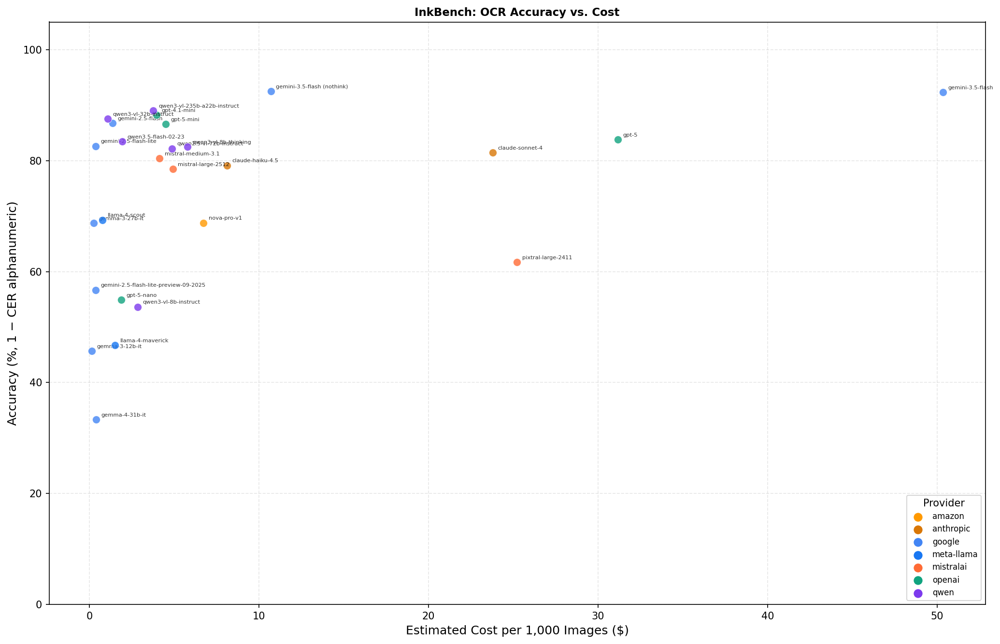

# InkBench

InkBench is a corpus designed to evaluate the ability of multimodal LLMs with vision inputs to transcribe historical documents. 


**Character Accuracy Results (1-CER).** *May 20, 2026.*

| Model | Overall | Book Page | Handwritten | Mixed | Other Typed/Printed | Cost per 1K |
|:---|:---:|:---:|:---:|:---:|:---:|:---:|
| google-gemini-3.5-flash (no-think) | 0.93 | 0.93 | 0.94 | 0.88 | 0.96 | $10.70 |
| google-gemini-3.5-flash | 0.92 | 0.94 | 0.94 | 0.87 | 0.95 | $50.33 |
| google-gemini-3.1-pro-preview (37) | 0.90 | | | | | $62.04 |
| google-gemini-3-flash-preview (389) | 0.89 | | | | | $3.45 |
| qwen-qwen3-vl-235b-a22b-instruct | 0.89 | 0.91 | 0.90 | 0.83 | 0.91 | $3.77 |
| anthropic-claude-sonnet-4.6 (39) | 0.89 | | | | | $23.07 |
| openai-gpt-4.1-mini | 0.88 | 0.88 | 0.91 | 0.83 | 0.93 | $3.97 |
| anthropic-claude-opus-4.6 (40) | 0.88 | | | | | $38.63 |
| qwen-qwen3-vl-32b-instruct | 0.88 | 0.91 | 0.87 | 0.79 | 0.94 | $1.08 |
| google-gemini-2.5-flash | 0.87 | 0.87 | 0.88 | 0.84 | 0.89 | $1.36 |
| openai-gpt-5-mini | 0.87 | 0.86 | 0.89 | 0.82 | 0.91 | $4.50 |
| openai-gpt-5.1 | 0.85 | 0.84 | 0.89 | 0.80 | 0.84 | $7.03 |
| openai-gpt-5 | 0.84 | 0.82 | 0.88 | 0.80 | 0.85 | $31.17 |
| google-gemini-2.5-flash-lite | 0.83 | 0.82 | 0.83 | 0.82 | 0.85 | $0.36 |
| qwen-qwen3-vl-8b-thinking | 0.82 | 0.87 | 0.77 | 0.81 | 0.86 | $5.79 |
| qwen-qwen2.5-vl-72b-instruct | 0.82 | 0.89 | 0.76 | 0.83 | 0.71 | $15.06 |
| openai-gpt-5.4 (39) | 0.82 | | | | | $28.74 |
| anthropic-claude-sonnet-4 | 0.81 | 0.85 | 0.77 | 0.80 | 0.84 | $23.78 |
| mistralai-mistral-medium-3.1 | 0.80 | 0.82 | 0.81 | 0.75 | 0.84 | $4.14 |
| anthropic-claude-haiku-4.5 | 0.79 | 0.85 | 0.71 | 0.78 | 0.83 | $8.10 |
| mistralai-mistral-large-2512 | 0.78 | 0.86 | 0.66 | 0.77 | 0.87 | $4.92 |
| openai-gpt-5.4-mini (39) | 0.78 | | | | | $8.63 |
| openai-gpt-4o-mini (39) | 0.75 | | | | | $13.06 |
| qwen-qwen-vl-plus | 0.74 | 0.83 | 0.58 | 0.75 | 0.85 | $0.83 |
| meta-llama-llama-4-scout | 0.69 | 0.81 | 0.45 | 0.73 | 0.86 | $0.78 |
| amazon-nova-pro-v1 | 0.69 | 0.67 | 0.66 | 0.72 | 0.80 | $6.73 |
| google-gemma-3-27b-it | 0.69 | 0.74 | 0.61 | 0.69 | 0.71 | $0.24 |
| mistralai-pixtral-large-2411 | 0.62 | 0.66 | 0.57 | 0.53 | 0.75 | $25.23 |
| openai-gpt-5-nano | 0.55 | 0.75 | 0.25 | 0.48 | 0.77 | $1.89 |
| qwen-qwen2.5-vl-32b-instruct | 0.53 | 0.63 | 0.45 | 0.31 | 0.76 | $5.83 |
| meta-llama-llama-4-maverick | 0.47 | 0.80 | 0.00 | 0.46 | 0.56 | $1.51 |
| google-gemma-3-12b-it | 0.46 | 0.61 | 0.49 | 0.18 | 0.33 | $0.13 |
| Tesseract | 0.34 | 0.54 | 0.01 | 0.29 | 0.63 | |

Models with (N) were evaluated on a sample rather than the full 400-image benchmark. Cost per 1K is the estimated cost to transcribe 1,000 images via OpenRouter, based on observed token usage.



## Run Your Own Model

To evaluate your own model on InkBench:

1. **Transcribe** each image in `benchmark-images/` and save the output as a plain text file in `ocr-results/<your-model-name>/`, using the image's filename with a `.txt` extension (e.g., `benchmark-images/mss1187900041-49.jpg` → `ocr-results/my-model/mss1187900041-49.txt`).

2. **Evaluate** by running:
   ```
   pip install jiwer
   python evaluate_accuracy.py
   ```
   Results are written to `evaluations/`.

That's it. The evaluation script automatically picks up any new model folders in `ocr-results/`. See `scripts/` for examples of how we transcribe using OpenRouter.

## Corpus
The corpus is constructed of a random sample of 400 images drawing from nine collections of Library of Congress images that were transcribed by volunteers in their [By the People](https://crowd.loc.gov/) project. Creation dates range from the late 1700s to early 1900s. Images were restricted to those containing a single page of more than 25 words. It consists of four kinds of documents:
* Book pages (n=160, median of 171 words per page)
* Handwritten pages (n=120, median of 171 words per page)
* Other printed materials (n=40, median of 168 words per page)
* Documents with print and handwritten (n=80, median of 90 words per page)

## Transcription
Each image is encoded to base64 and paired with a detailed system prompt based on the [LoC guidelines](https://crowd.loc.gov/get-started/how-to-transcribe/) that sets strict transcription rules (*e.g.,* preserve spelling, mark deletions, handle illegible text). Two sample image–transcription pairs are also included as conversation history to provide the model with concrete examples of how to transcribe. Each model is accessed through [OpenRouter](https://openrouter.ai/).

## Accuracy
We evaluate each model's transcription against the reference text using three error measures (all lower is better): WER (Word Error Rate), which counts substitutions, insertions, and deletions at the word level after normalizing by lowercasing, collapsing spaces, stripping ends, and tokenizing into words; CER (Character Error Rate), which applies the same substitution/insertion/deletion logic at the character level after stripping and lowercasing; and CER (alphanumeric-only, lowercase), which first removes all non-alphanumeric characters ([^0-9a-z]) and lowercases before computing character errors, making it less sensitive to punctuation and diacritics and serving as the default for headline comparisons. Final accuracy displayed is 1 – CER.
